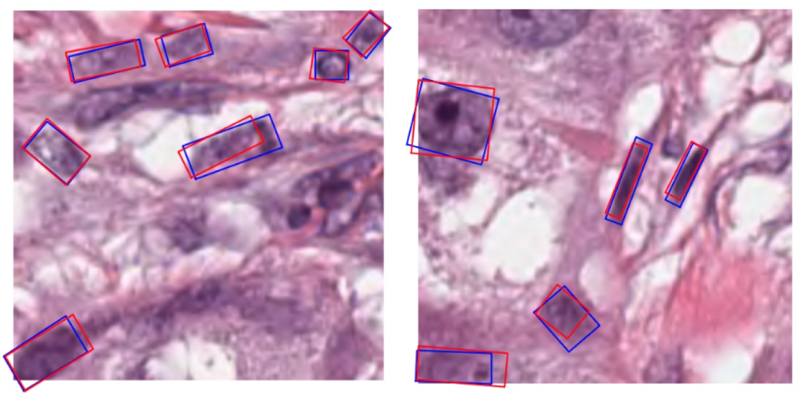

# Rotated Cell-DETR: Cell detection with oriented bounding boxes

This repository contains the code for Rotated Cell-DETR, an extension of [Cell-DETR](https://github.com/oscar97pina/celldetr) that performs cell nuclei detection in histopathology images using oriented bounding boxes. Traditional object detection methods use axis-aligned bounding boxes, which are often not precise enough to capture the shape and orientation of elongated or irregularly shaped cells.  Rotated Cell-DETR addresses this by predicting oriented bounding boxes, which provide a more concise localization of the cell.

The main novelty that we introduce is that we achieve the oriented detections without requiring explicit oriented bounding box annotations during training. Instead, we leverage available segmentation masks (common in cell detection datasets such as PanNuke) and extract image moments (centroid, variances, and covariance) to represent the shape and orientation of each cell.  These moments are then used as targets for a modified loss function based on the KL-divergence which is then used for training an adapted version of the DETR architecture to predict oriented bounding boxes.

For a more detailed explanation of the methodology, experiments and results, please see the full report: [Report](rotated_celldetr_report.pdf)

<div align="center">
    
    <p><em>Examples with predicted oriented bounding boxes in blue and ground truth oriented bounding boxes in red.</em></p>
</div>

## Table of Contents

- [Installation](#installation)
- [Usage](#usage)
- [Acknowledgements](#acknowledgements)
- [License](#license)

## Installation

1. Create a Virtual environment
```bash
python3 -m venv myenv
```

2. Activate the environment
```bash
source myenv/bin/activate
```

3. Install torch>=2.1.1 and torchvision>=0.16.1. We've used cuda 11.8. You can find more information in the [official website](https://pytorch.org/get-started/locally/).
```bash
pip3 install torch torchvision --index-url https://download.pytorch.org/whl/cu118
```

4. Install the other requirements
```bash
pip3 install -r requirements.txt
```

5. Build the MultiScaleDeformAttn module (you will need GPU, follow the authors' [instructions](https://github.com/fundamentalvision/Deformable-DETR))
```bash
cd celldetr/models/deformable_detr/ops
./make.sh
``` 

## Usage

### Project structure
```bash
rotated_celldetr/
|-- tools/                   # Contains scripts for training, evaluation, and inference
|   |-- train.py             # Training on COCO format dataset
|   |-- eval.py              # Evaluation on COCO format dataset
|-- eval/                    # Evaluation module for evaluating model performance
|-- util/                    # Utility functions and modules used throughout the project
|-- data/                    # Datasets, transforms and augmentations for cell detection
|-- models/                  # Deep learning models used in CellDetr
|   |-- deformable_detr/     # Implementation of Deformable DETR model
|   |-- backbone/            # Backbone networks used in the models
|-- engine.py                # Main engine script for coordinating the training and evaluation process

```

Key modifications to the original Cell-DETR codebase include:

*   `rotated_celldetr/data/transforms.py`:  The `MaskToMoments` transform extracts image moments from segmentation masks.
*   `rotated_celldetr/util/moment_ops.py`:  Functions for handling image moments and calculating the KL-divergence loss.
*   `rotated_celldetr/eval/celldet_eval.py`:  The `CellDetectionMetric` calculates the Rotated Intersection over Union (IoU) metric.
*   `rotated_celldetr/models/deformable_detr/`:  Modifications to the model to predict moments and use the KL-divergence loss.

### Training and Testing

1.  **Data preparation:** The code expects data in COCO format.  We primarily use the PanNuke dataset.  You can use the provided scripts in `rotated_celldetr/data/` (specifically `pannuke.py`) to convert the PanNuke dataset to COCO format.

2.  **Training:** Use the `tools/train.py` script.  Create a configuration file in `configs/experiments/` that inherits from the base configurations and specifies your desired settings.

    ```bash
    python -m torch.distributed.launch --use-env --nproc-per-node=2 tools/train.py \
        --config-file configs/experiments/pannuke/rotated_deformable_detr_swinL_4lvl_split123.yaml \
    ```

3.  **Evaluation:** Use the `tools/eval.py` script with the *same* configuration file used for training:

    ```bash
    python -m torch.distributed.launch --use-env --nproc-per-node=2 tools/eval.py \
        --config-file configs/experiments/pannuke/rotated_deformable_detr_swinL_4lvl_split123.yaml \
    ```

    The script will load the trained model from the `output_dir` specified in your configuration file.

## Acknowledgements

This work builds upon [Cell-DETR](https://github.com/oscar97pina/celldetr) by Oscar Pina, who has also supervised this work.

## Citation
```bash
@inproceedings{
       pina2024celldetr,
       title={Cell-{DETR}: Efficient cell detection and classification in {WSI}s with transformers},
       author={Oscar Pina and Eduard Dorca and Veronica Vilaplana},
       booktitle={Submitted to Medical Imaging with Deep Learning},
       year={2024},
       url={https://openreview.net/forum?id=H4KbJlAHuq},
       note={under review} }
```

## License
[](LICENSE)

This project is licensed under the [MIT License](LICENSE).
